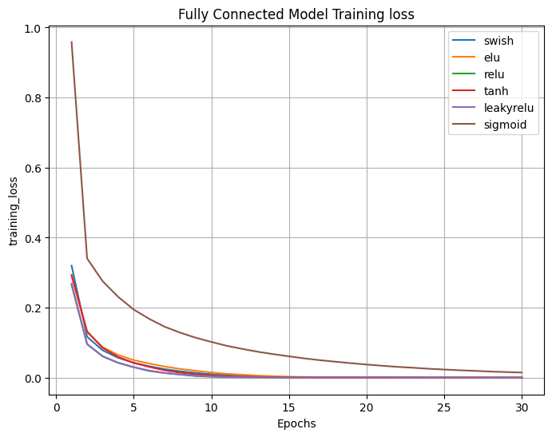

# Compare Activation Functions
Simple repo to train and evaluate models using different activation functions

<p align="center">

</p>

### Training

Train a model with with `train.py`. During training you can use tensorboard to observe training loss & validation accuracy.  Logs will be stored in the act_fn_experiment folder.

| Args 	| Options 	| Description 	|
|---------|--------|----------------------------------------------------|
| dataset 	| mnist (more to come) 	| Selects which dataset to train on. 	|
| model 	| fc (more to come) 	| Selects which model architecture to use. 	|
| act_fn 	| sigmoid, <br>tanh, <br>relu, <br>leakyrelu, <br>elu, <br>swish 	| Selects activation function used in model	|
| epochs 	| [int] 	| Number of epochs for training. 	|
| lr 	| [float] 	| Learning rate. 	|
| batch_size 	| [int] 	| Number of samples per batch. 	| 

### Example
Train a 2 layer fully connected model with relu activations on mnist
```
python train.py --dataset mnist --model fc --act_fn relu --epochs 30
